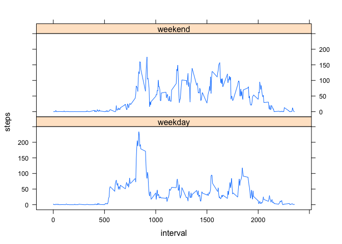

# Reproducible Research: Peer Assessment 1


## Loading and preprocessing the data


```r
setwd("/Users/bcollier/Dropbox/Projects/Projects/LEARNING - Data Science Coursera Track/05 - Reproducible Research/assignments/assign2/RepData_PeerAssessment1")

fileURL <- "https://d396qusza40orc.cloudfront.net/repdata%2Fdata%2Factivity.zip"
# download.file(fileURL, destfile = "activity.zip", method="curl")

unzip("activity.zip")

activity <- read.table("activity.csv", header=TRUE, sep=",", na.strings="NA")
```


## What is mean total number of steps taken per day? What does the histogram look like?


```r
activity_complete <- activity[complete.cases(activity), ]
mean(activity_complete$steps)
```

```
## [1] 37.3826
```

```r
sum(activity_complete$steps)
```

```
## [1] 570608
```

```r
hist(activity_complete$steps)
```

 


## What is the average daily activity pattern?


```r
stepsInterval <- aggregate(steps ~ interval, data = activity_complete, FUN=mean)
names(stepsInterval) <- c("interval", "steps_mean")
plot(stepsInterval, type = "l", main="The average number of steps by interval")
```

 

## Imputing missing values

Total number of missing values


```r
missing_values <- sum(is.na(activity))
missing_values
```

```
## [1] 2304
```


Get the means for each day, and copy the dataframe into a new dataframe

```r
nas_vector <- is.na(activity$steps)
stepsDay_mean <- aggregate(steps ~ date, data = activity, FUN=mean, na.rm=FALSE)
names(stepsDay_mean) <- c("date", "steps_mean")

imputed_activity <- activity
```

Loop through the set and impute missing values


```r
for (i in 1:nrow(imputed_activity)){
  if (nas_vector[i]==TRUE){
    date <- imputed_activity$date[i]
    date <- as.Date(date, "%Y-%m-%d")
    if (is.na(stepsDay_mean$steps_mean[date])){
      imputed_activity$steps[i] <- 0
    }
    else {
      imputed_activity$steps[i] <- stepsDay_mean$steps_mean[date]
    }
  }
}
```


Check results, see histogram and mean and median


```r
sum(complete.cases(activity))
```

```
## [1] 15264
```

```r
sum(complete.cases(imputed_activity))
```

```
## [1] 17568
```

```r
hist(imputed_activity$steps)
```

 

```r
mean(imputed_activity$steps)
```

```
## [1] 32.47996
```

```r
median(imputed_activity$steps)
```

```
## [1] 0
```

## Are there differences in activity patterns between weekdays and weekends?


```r
s <- as.Date(activity$date, "%Y-%m-%d")
activity$day <- weekdays(s)
activity$day_type <- c("weekday")

for (i in 1:nrow(activity)){
    if (activity$day[i] == "Saturday" || activity$day[i] == "Sunday"){
      activity$day_type[i] <- "weekend"
    }
}

stepsInt <- aggregate(steps ~ interval + day_type, data=activity, FUN=mean)
names(stepsInt) <- c("interval", "day_type", "steps")

library(lattice)
xyplot(steps ~ interval | day_type, stepsInt, type = "l", layout = c(1, 2))
```

 
